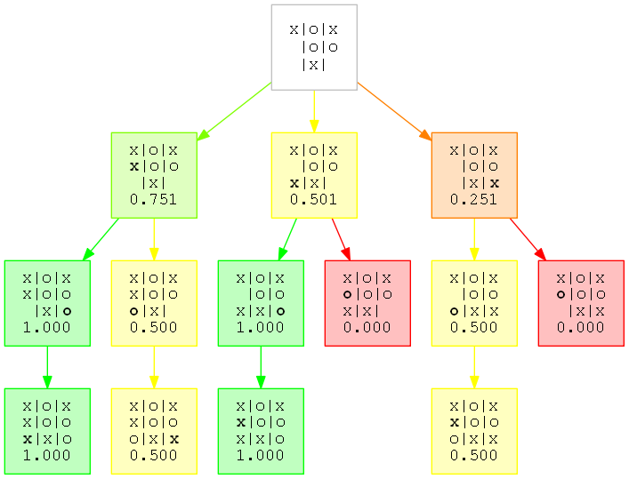

# TicTacToe

This project represents the development of a prototype [m,n,k game](https://en.wikipedia.org/wiki/M,n,k-game)
simulator for research purposes. It is intended to enable the development of 
agents that use techniques such as reinforcement learning, Monte Carlo tree 
search and other approaches to play simple m,n,k games such as Tic-Tac-Toe.

The project provides a simulation engine in the `tictactoe` module to model the
flow of a game, requesting moves from each player in turn and storing the state 
of the game board.

Game rules are defined in the `rules` module and may be modified to model 
different game types.

A number of game players, including simple agents and an interactive player, are
provided in the `players` module. More complex agents are located in the 
`agents` subpackage.

 The game may be run interactively as follows:

    > python tictactoe.py
 
The simulator may also be run in batch mode to train learning agents; an example
is provided in the `batch_run_rl_agents` module. 

#### Visualisation

Tools for visualising agent reasoning are provided in the `graphing` module.
 
For example, a graph of the playout tree generated by the MCTS agent during a 
move may be generated using the `MCTSGraph` class:

#### Game complexity

The upper bound on complexity (number of states) for a 3x3 board is 3^9 = 19,683
(three states for each cell and nine cells). Excluding illegal moves (e.g. five
noughts and no crosses), the number of possible states is 5478. Most of these
are rotations or reflections of other states; excluding these gives 765 unique
states.

#### Documentation format

The documentation follows the Google Python docstring style for readability,
and may require the Sphinx Napoleon extension for conversion to restructured 
text. See https://sphinxcontrib-napoleon.readthedocs.org/en/latest/ and
http://google.github.io/styleguide/pyguide.html#Comments
